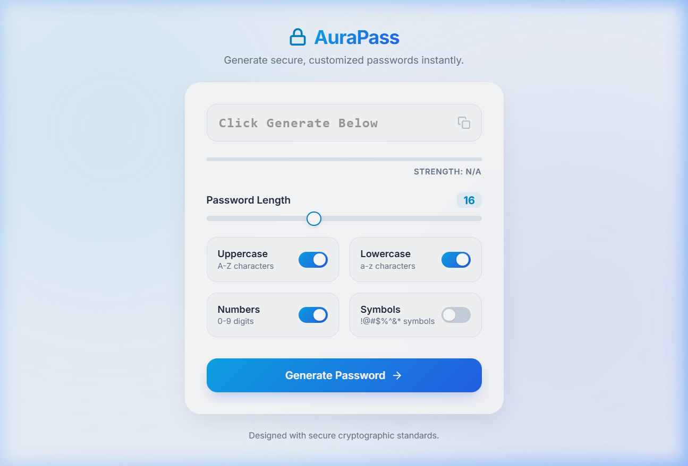
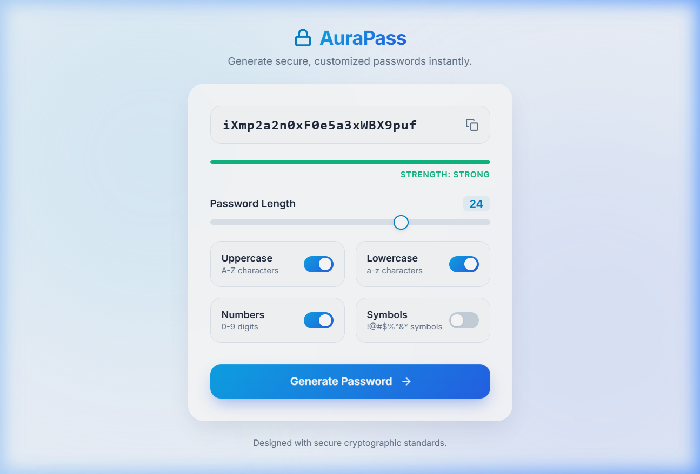
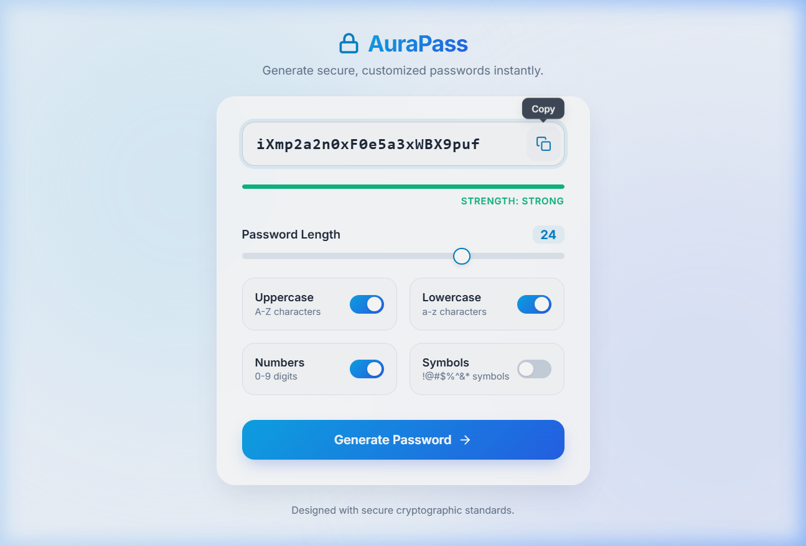

# AuraPass — Elegant Password Generator

AuraPass is an elegant, responsive, and cryptographically secure password generator. It is built using **Python (Flask)** for the backend API and modern **HTML/CSS/JS (Vanilla)** for the frontend.

The frontend is kept completely separate and located at the root level (`index.html`, `style.css`, `script.js`) so that it can be hosted directly on **GitHub Pages**, while the backend Flask API (`index.py`) can be deployed to a python hosting provider (e.g. Render, Vercel, PythonAnywhere).

---

## Features

- **Cryptographically Secure**: Utilizes Python’s `secrets` module to generate truly random values.
- **Customizable Length**: Range slider (seek bar) to choose lengths from 6 to 32 characters.
- **Flexible Character Options**: Dynamic toggles for uppercase letters, lowercase letters, numbers, and symbols.
- **UI State Logic**:
  - The password display box and Copy button are disabled until a password is generated.
  - Interactive tooltip feedback on copy ("Copy" changes to "Copied!").
  - Enforced selection constraint (prevents setting all toggles to off).
- **Cool Light Aesthetic**: Glassmorphism dashboard container, animated floating background blobs, custom iOS-style toggles, and responsive mobile-first design.
- **Real-time Strength Meter**: Visual indicator showing password strength (Weak, Medium, Strong) dynamically based on length and complexity.

---

## App Interface Preview

### 1. Initial Load (Disabled States)


### 2. Password Generated (Active States & Strength Analysis)


### 3. Clipboard Copy Interaction (Feedback Tooltip)


---

## File Structure

```text
password_generator/
│
├── index.py           # Flask Backend & API Endpoint
├── index.html         # Main Frontend HTML Page
├── style.css          # Cool Light Theme Stylesheet
├── script.js          # Client-side Interactive Logic
├── README.md          # User Guide & App Documentation
├── project_report.md  # Detailed Project Summary & Development Report
└── assets/            # Embedded Media & Interaction Assets
    ├── initial_load.png
    ├── password_generated.png
    ├── copied_feedback.png
    ├── toggle_limits.png
    ├── validation_warning.png
    └── userflow_demo.webp
```

---

## Installation & Running Locally

Ensure you have Python installed, then follow these steps:

### 1. Clone the repository
```bash
git clone https://github.com/your-username/password_generator.git
cd password_generator
```

### 2. Install Flask
```bash
pip install flask
```

### 3. Start the Flask server
```bash
python index.py
```

### 4. View the App
Open your browser and navigate to:
[http://127.0.0.1:5000](http://127.0.0.1:5000)

---

## Deploying to GitHub Pages (Static Frontend Only)

Since the frontend consists of standalone static assets in the root folder, you can easily host the user interface on GitHub Pages:

1. Push this repository to GitHub.
2. In your GitHub repository settings, go to the **Pages** tab.
3. Under **Build and deployment**, set the source to `Deploy from a branch` and choose your main branch and root `/` directory.
4. Update the endpoint URL in [script.js](file:///c:/Users/Work/agy-ide-projects/PythonProjects/password_generator/script.js#L95) to point to your live hosted API (e.g. `https://your-flask-app.onrender.com/api/generate`) instead of `/api/generate` to enable password generation on your static site.

---

## User Flow Demo
Watch the interactive user flow in action:


