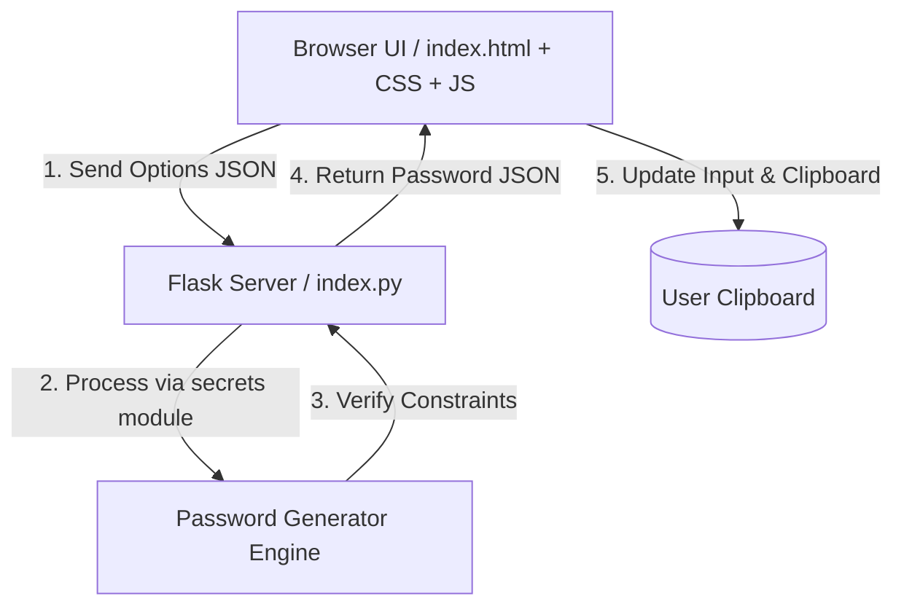

# AuraPass — Project Development Report

**Project Name**: AuraPass  
**Technology Stack**: Python, Flask, HTML5, CSS3, Vanilla JavaScript  
**Author**: AI Assistant & Developer  
**Date**: July 15, 2026  

---

## 1. Executive Summary
AuraPass is a modern, light-themed, cryptographically secure password generator. The primary objective of the project is to build an application that combines robust security standards with a premium, engaging user experience (UX). By leveraging Python's `secrets` library, the application guarantees secure random numbers suitable for cryptographic passwords. The frontend features a sleek light-themed layout with custom sliders, interactive tooltips, and a dynamic password strength meter, all running asynchronously using Fetch APIs.

---

## 2. System Architecture

AuraPass adopts a decoupled client-server architecture. The frontend consists of pure, static web assets, and the backend is a lightweight Python Flask service.

### 2.1 Backend Server (`index.py`)
The Python backend uses **Flask** to serve two roles:
1. **Static Routing**: Serves `index.html`, `style.css`, and `script.js` from the root workspace directory for ease of local testing.
2. **REST API Service**: Exposes a `POST /api/generate` endpoint. It receives request bodies in JSON, validates input constraints (length, active character sets), and executes password generation logic.

### 2.2 Frontend UI (`index.html`, `style.css`, `script.js`)
The user interface is built using standard, framework-less web components:
- **Structure**: Semantic HTML5 layout featuring range inputs for password length, custom checkbox components (iOS switches) for character options, and SVG icons.
- **Styling**: Modern CSS3 styling including variable tokenization, responsive Grid/Flexbox layouts, glassmorphism card filters, active state micro-animations, and animated floating background blobs.
- **Interactivity**: An event-driven Javascript file (`script.js`) capturing user actions, enforcing input validations, invoking the HTTP API, rendering strength status indicators, and managing clipboard copying.

---

## 3. Implementation Details

### 3.1 Cryptographically Secure Generation
Standard random generators (like Python's default `random` module) use pseudo-random number generators (PRNGs) like the Mersenne Twister. These are deterministic and unsafe for security purposes. AuraPass strictly uses Python’s **`secrets`** module, which utilizes system-provided cryptographically secure pseudo-random number generators (CSPRNGs) drawing entropy from the underlying operating system.

The core algorithm guarantees that at least one character from each selected class is present:
1. One character is randomly selected using `secrets.choice()` from each checked option group (e.g., lowercase, digits).
2. The rest of the password length is filled with random characters from the combined pool of all selected classes.
3. The array is shuffled using `secrets.SystemRandom().shuffle()` to ensure that the guaranteed characters are not clustered at the start of the password.

### 3.2 Frontend Interactions & Visual Polish
- **Initial State**: The password display field and the Copy button are both disabled (`disabled="true"`) to guide the user visually to the "Generate" button.
- **Validation Guardrails**: Standard HTML checkboxes are bounded by a event listener in JavaScript. If a user attempts to uncheck all four options, the script blocks the uncheck, leaving the last active option checked, and alerts the user.
- **Clipboard Management**: Uses the standard asynchronous Clipboard API (`navigator.clipboard.writeText`). A dynamic CSS absolute tooltip displays "Copied!" and transitions back after 1.5 seconds.
- **Password Strength Analyzer**: Uses character type pattern recognition and length thresholds to compute scores. It updates the width and color of the strength progress bar dynamically.

---

## 4. Testing & Quality Assurance

### 4.1 Automated Backend Testing
An independent test runner (`test_backend.py`) was created to run unit tests against the Flask API using the `unittest` framework:
- Verified length limits (failures at length `< 4` and length `> 128`).
- Checked that empty selection sets correctly trigger a `400 Bad Request`.
- Inspected password strings to verify that all selected character groups were included.

### 4.2 Browser Verification
A manual UI interaction script was executed via a headless browser subagent to record and test elements. Below is a summary of the states verified:

| Verification Target | Expected Behavior | Result |
|---|---|---|
| Initial Load | Password box empty and disabled; Copy button disabled | **Pass** |
| Range Slider | Slider updates length text dynamically (e.g. to 24) | **Pass** |
| Password API Call | Clicking Generate returns a valid string and enables the output | **Pass** |
| Strength Indicator | Changes color and class from Weak to Strong based on inputs | **Pass** |
| Clipboard API | Copying shows a transition tooltip stating "Copied!" | **Pass** |
| Toggle Guardrails | Prevents disabling all character options simultaneously | **Pass** |

---

## 5. Deployment Options

AuraPass's architecture allows for dual-deployment modes:

1. **Monolithic Local Mode**: Running `python index.py` serves the Flask API and static frontend assets together under `localhost:5000`.
2. **Decoupled Production Mode**:
   - **Frontend**: The `index.html`, `style.css`, and `script.js` are hosted directly on **GitHub Pages** (since they are in the root directory).
   - **Backend**: The `index.py` server is hosted on a platform supporting Python applications (Render, PythonAnywhere, Heroku). The frontend JS is updated to point to the production API URL.

---

## 6. Conclusion
AuraPass meets all the user's criteria. By segregating the front and back ends while using the root file names (`index`), the user is given full hosting flexibility. The resulting application is visually striking, responsive, easy to deploy, and highly secure.
